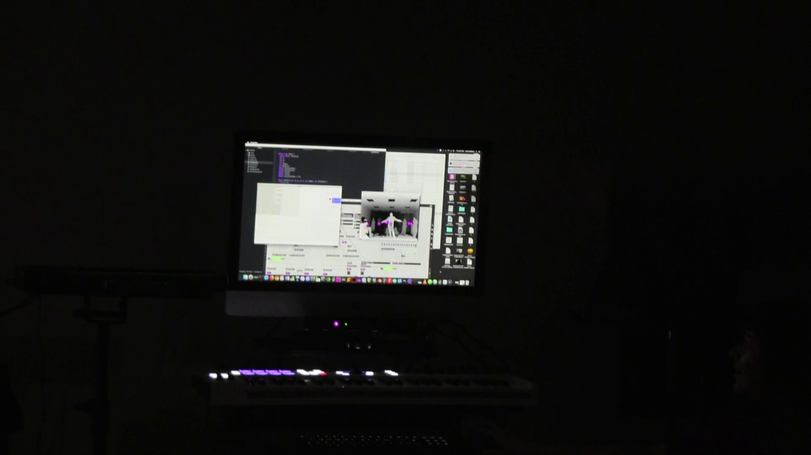

# KinectProximity

KinectProximity uses machine vision libraries for Processing to capture proximity data to 3D points that can be set using a Wii remote and the position of the user’s right hand. Once the points are set, the system will output OSC data containing the proximity of the user’s hands, feet, head, and body. In one project, I used the data to control lighting instruments that lit up when the user’s hands got close to them. For another project, I collaborated with Marly Gonzales on a proximity based Max/MSP instrument. I imagine a potential future use for this software could potentially be in a collaboration with dancers to control scenery elements that have lights and speakers embedded within them.